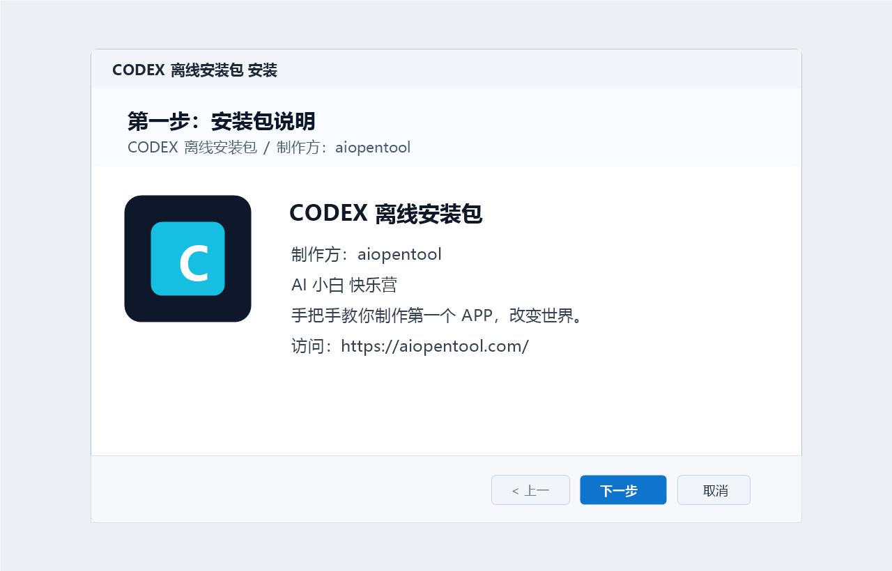
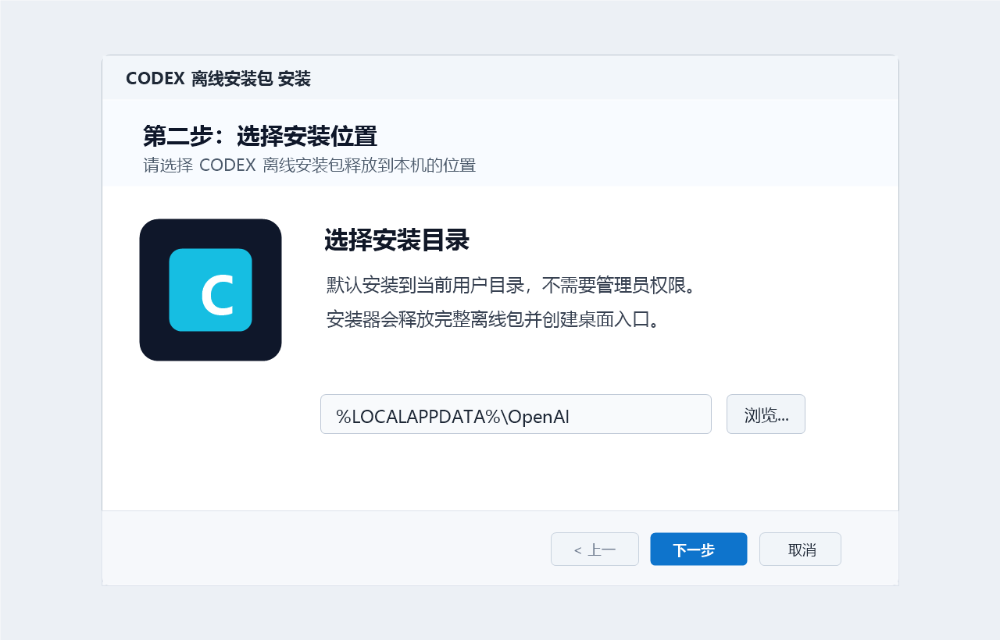
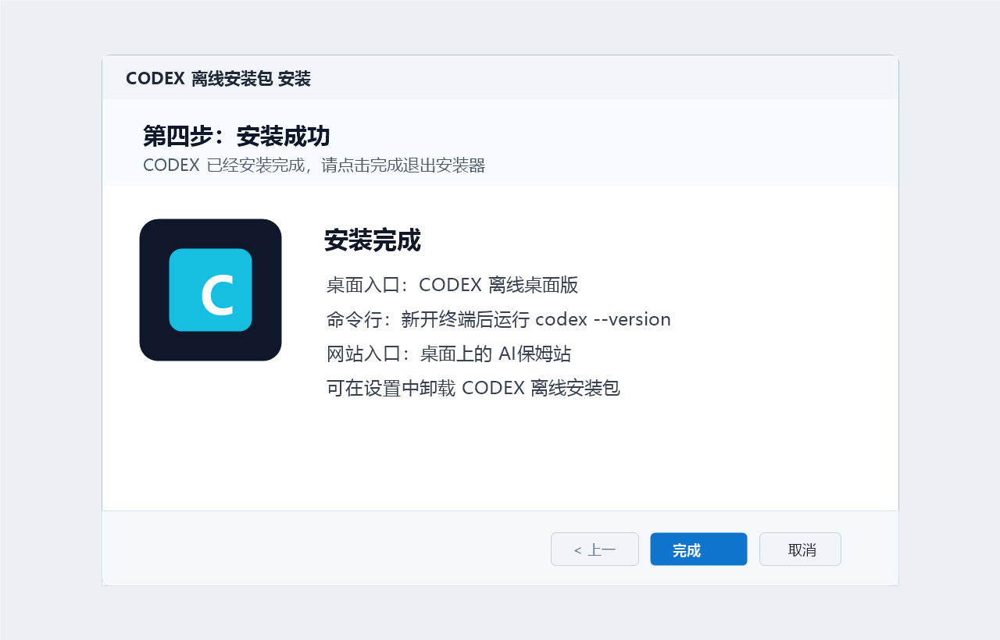

# Codex Offline Windows x64


一个面向 Windows x64 的 Codex 0.135.0 全量离线安装包整理项目，目标是在 Win10、Win11 和 Windows Server x64 环境里尽量减少现场下载依赖。

> 非官方打包项目。Codex、OpenAI、Node.js、Microsoft Visual C++ Redistributable 等组件分别归其原权利方所有。公开分发二进制前，请确认你拥有对应组件的再分发权限。

## 下载

发布版本：`v0.135.0`

| 文件 | 用途 | 大小 |
| --- | --- | --- |
| `codex-offline-windows-x64-0.135.0-setup.exe` | 一键安装器，适合普通用户直接安装 | 877,258,199 bytes |
| `codex-offline-windows-x64-0.135.0-full.tar.gz` | 完整离线包归档，适合手动解压、审计或二次打包 | 851,183,792 bytes |

发布附件地址：

```text
https://github.com/izmppj740/codex-offline-windows/releases/tag/v0.135.0
```

## SHA256

```text
03A82F40C82C7CB2EA889C75B18C0AA229344010E07BB586FF1A3D1667288891  codex-offline-windows-x64-0.135.0-setup.exe
C85E03CC4660124853CACF667FAA68FA29BA245DDB10946C1F722B32A19874EF  codex-offline-windows-x64-0.135.0-full.tar.gz
```

Windows PowerShell 校验：

```powershell
Get-FileHash -Algorithm SHA256 .\codex-offline-windows-x64-0.135.0-setup.exe
Get-FileHash -Algorithm SHA256 .\codex-offline-windows-x64-0.135.0-full.tar.gz
```

## 一键安装

1. 下载 `codex-offline-windows-x64-0.135.0-setup.exe`。
2. 双击运行安装器。
3. 选择安装目录，默认安装到当前用户的 `%LOCALAPPDATA%\OpenAI`。
4. 安装完成后，新开终端运行：

```powershell
codex --version
```

安装器会创建：

- 桌面入口：`CODEX 离线桌面版`
- 开始菜单入口：`CODEX 离线桌面版`
- 命令行入口：`CODEX 命令行`
- 当前用户 PATH：自动加入离线 CLI 路径

## 手动解压安装

如果不想运行安装器，可以下载 `full.tar.gz` 手动解压：

```powershell
tar -xzf .\codex-offline-windows-x64-0.135.0-full.tar.gz -C .\
cd .\codex-offline-windows-x64-0.135.0
.\install-cli-offline.ps1
.\verify-package.ps1
```

如果目标机器已经有 Node.js 16 或更新版本：

```powershell
.\install-cli-offline.ps1 -SkipNodeInstall
```

也可以直接运行包内原生 CLI：

```powershell
.\cli-native\codex.cmd --version
```

## 安装截图







## 包内内容


完整离线包包含：

- Codex CLI `0.135.0`
- Windows x64 原生 Codex CLI vendor 文件
- Node.js x64 安装器
- npm 离线缓存
- Codex Desktop 提取负载和 Store 安装入口脚本
- Microsoft Visual C++ 2015-2022 x64 运行库安装器
- 安装、卸载、PATH 写入、包校验脚本
- `checksums.sha256` 包内文件校验清单

## 仓库结构

```text
.
├── codex-offline-installer.nsi          # NSIS 一键安装器脚本
├── package-scripts/                     # full.tar.gz 内的安装脚本模板
├── release-manifest/                    # Release 附件 SHA256 和包内校验清单
├── docs/assets/                         # 宣传图
├── docs/screenshots/                    # 安装截图
└── tools/render-doc-assets.ps1          # 文档图片生成脚本
```

大体积安装包不提交到 git，请通过 GitHub Releases 发布。

## 重新打包

准备好同级目录文件：

```text
codex-offline-windows-x64-0.135.0-full.tar.gz
installer-assets\codex.ico
installer-assets\ai-baomu.ico
installer-assets\vc_redist.x64.exe
```

然后用 NSIS 编译：

```powershell
makensis.exe .\codex-offline-installer.nsi
```

如需自定义输出文件名：

```powershell
makensis.exe /DSETUP_OUTFILE=codex-offline-windows-x64-0.135.0-setup.exe .\codex-offline-installer.nsi
```

## 卸载

可以从 Windows 设置里卸载 `CODEX 离线安装包`，也可以运行安装目录里的：

```powershell
.\Uninstall.exe
```

卸载会清理桌面快捷方式、开始菜单快捷方式、当前用户 PATH 和安装目录。
